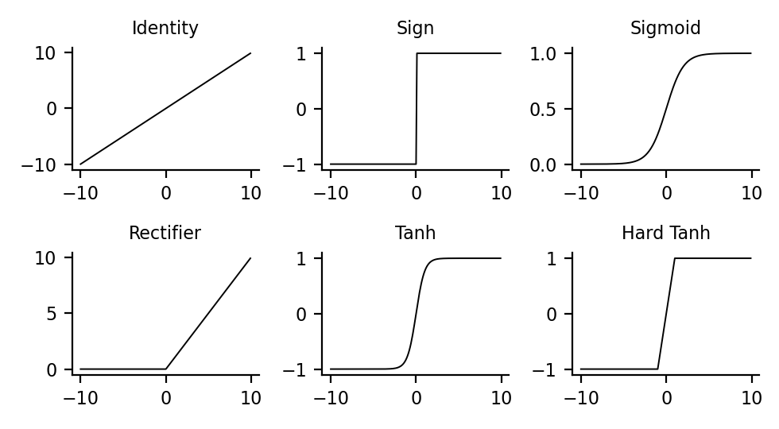
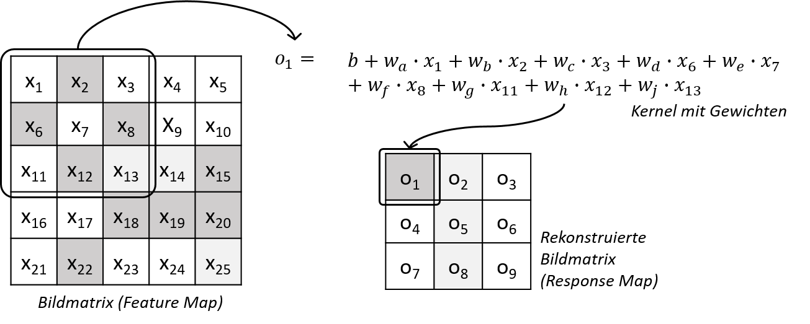

# Repository zum Hanser-Buch *Machine Learning für Zeitreihen* (2021)

### Inhalt
1. [Arbeiten mit dem Repository](aArbeiten-mit-dem-repository)
2. [Virtuelle Umgebung](#virtuelle-umgebung)
3. [Kontakt](#Kontakt-bei-Fragen-und-Problemen)
4. [Korrekturen](#Korrekturen)
***
### 1. Arbeiten mit dem Repository 
Die Ordner des Repositorys sind entlang der Kapitel des Buches organisiert. 
In den Kapiteln finden Sie jeweils die Codebeispiel als *Jupyter Notebooks* (\*.ipynb-Dateien). 
Sie können das komplette Repository entweder auf ihren Rechner herunterladen oder auf die Jupyter Notebooks direkt im Internet zugreifen 
und den Code und die Resultate einsehen.  
Wenn Sie das Repository herunterladen möchten, müssen Sie *git* auf ihrem Rechner installiert haben. Die Software ist kostenlos verfügbar
zum Beispiel unter *https://git-scm.com/downloads*. Wenn Sie die Software installiert haben, können Sie das komplette Repository
aus dem Terminal-Fenster mit folgendem Befehl lokal speichern: 
  git clone https://github.com/tplusone/hanser_ml_zeitreihen.git
 
### 2. Virtuelle Umgebung
Die Datei **requirements.txt** enthält alle Python-Bibliotheken, die zur Ausführung der Codebeispiele notwendig sind. 
Wenn Sie eine virtuelle Umgebung in Anaconda anlegen möchten, die diese Bibliotheken enthält, navigieren Sie über das Anaconda-Terminalfenster
(Anaconda Prompt) einfach in den Basisordner des Repositories (*hanser_ml_zeitreihen*) und geben 
dann folgenden Befehl unter Einfügung eines Namens für die env *<env_name>* ein: 
  conda create --name <env_name> --file requirements.txt
Nach Fertigstellung der Environment lässt sich die Umgebung mit *conda activate <env_name>* einfach aktivieren. 
Wenn Sie stattdessen mit *pip* arbeiten, können Sie die Bibliotheken auch mit folgendem Befehl in ihre Umgebung laden: 
  pip install -r requirements.txt
Alternativ können Sie die notwendigen Bibliotheken natürlich auch manuell installieren. Sie benötigen im Wesentlichen folgende Module: 
- python, Version=3.7.7
- statsmodels=0.11.1
- pandas, Version=1.1.1
- scikit-learn, Version=0.22.1
- tensorflow, Version=2.1.0
- seaborn, Version=0.10.1

### 3. Kontakt bei Fragen und Problemen
Wenn Sie Fragen zum Code oder zum Buch haben, können Sie entweder hier auf *github* einen *Issue* eröffnen oder sich direkt per Mail
an <tplusone[at]posteo.de> wenden.

***

# 4. Korrekturen

Liebe LeserInnen,  
wie moderne Software lebt auch ein Fachbuch von Hinweisen zu Problemen und Bugs. 
Ich danke deshalb ganz herzlich den LeserInnen für ihre Kommentare!  
Wenn Sie weitere inkorrekte oder unklare Textpassagen im Buch finden, die unten noch nicht aufgeführt sind, eröffnen Sie gerne einen Issue hier auf *GitHub* oder schreiben Sie eine E-Mail an <tplusone[at]posteo.de>!  
Im Folgenden finden Sie eine Liste mit fehlerhaften oder problematischen Textstellen inkl. Korrektur.  
  
Herzlichen Dank für Ihr Verständnis!  
***
## Korrekturen nach Kapiteln/Abschnitten
**_Kapitel 3, Abschnitt 3.5.2, S. 93_**

In den abgedruckten Formeln sind die _x_-Werte und die Gewichtungen (betas) vertauscht. Die Zahlenwerte (0/1), die die zu modellierenden Situationen bezeichnen, werden als _x_-Werte eingesetzt und nicht als Gewichtungen (betas). Es müsste also heißen:

***
**_Kapitel 5, Abschnitt 5.1.1, S. 151, Bild 5.2_**

In _Bild 5.2_ sind die _y_-Achsenbeschriftungen der Aktivierungsfunktionen zum Teil falsch wiedergegeben. Zum Beispiel werden in der Identity-Funktion die _x_-Werte unverarbeitet auf die _y_-Achse projiziert. Richtig ist also folgende Darstellung:

***
**_Kapitel 5, Abschnitt 5.5.1, S. 205, Bild 5.18_**

In Bild 5.18 sind die _x_-Werte den Gewichten zum Teil falsch zugeordnet. Dargestellt ist die Arbeit des Kernels im Hinblick auf den ersten Bildauszug, der die Werte _x_-Werte 1, 2, 3, 6, 7, 8, 11, 12, 13 bearbeitet. Richtig ist also folgende Darstellung:

***
**_Kapitel 5, Abschnitt 5.6.2, S. 223 Ausgabe oben_**

Hier ist die falsche Shape angegeben. Es müsste heißen:

    (56104, 14), (14025, 14), (56104, 1), (14025, 1)  
***
**_Kapitel 5, Abschnitt 5.6.2, S. 226 Code unten_**

Es fehlt der Import der LSTM-Layer. Der Code müsste also lauten:

    1	from tensorflow.keras.models import Sequential
    2	from tensorflow.keras.layers import (Dense, Dropout, Conv1D, 
    3	                                    LSTM, Bidirectional)
    4	from tensorflow.keras.regularizers import l2
    5	reg = l2(0.0001)
    6	model = Sequential()
    7	model.add(Conv1D(filters=32, kernel_size=6, 
    8	                input_shape=(144, 14), 
    9	                activation='relu'))
    10	model.add(Dropout(0.3))
    11	model.add(Bidirectional(LSTM(units=32, dropout=.3, 
    12	            kernel_regularizer=reg)))            
    13	model.add(Dense(units=1, kernel_regularizer=reg))
    14	model.compile(loss='mse', optimizer='adam', metrics=['mae'])

